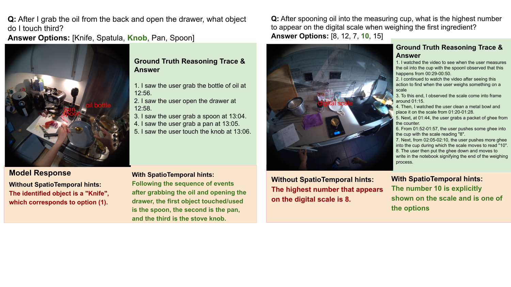
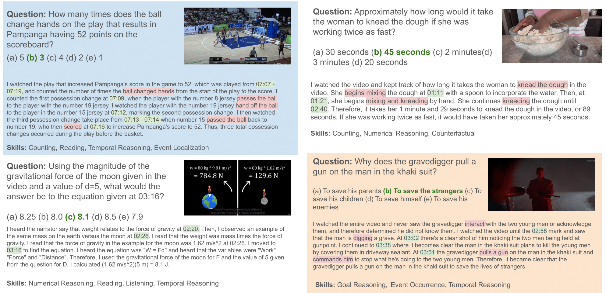
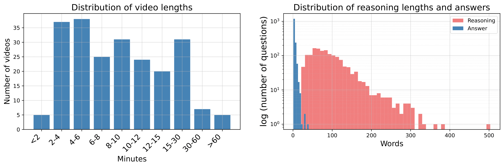
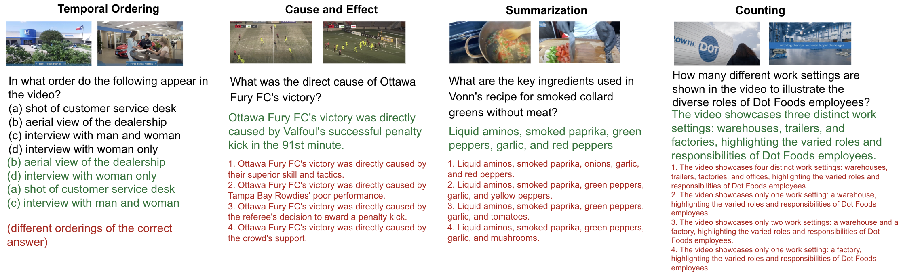
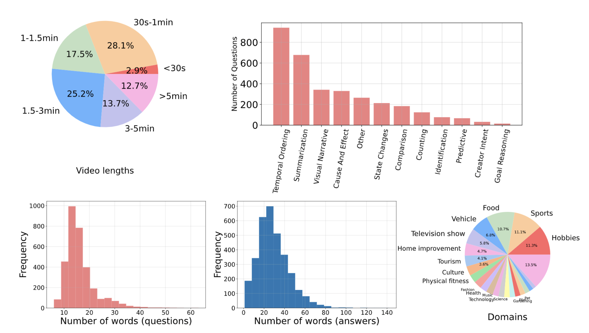

# Neptune Dataset Collection

## Tl;dr
This page covers the Neptune Dataset Collection which is a set of video QA
datasets.
This collection currently includes [Minerva-Ego](#minerva-ego),
the [MINERVA](#minerva) dataset and the original [Neptune](#neptune) dataset.

## Minerva-Ego
Minerva-Ego extends the MINERVA benchmark to egocentric video. It consists of
1,160 complex multiple choice questions over videos selected from the
[HD-EPIC](https://epic-kitchens.github.io/epic-fields/) dataset. As with
MINERVA, each question is accompanied by a dense, spatiotemporally grounded
reasoning trace that connects the steps required to solve the problem to
specific timestamps and objects within the video. All annotations in Minerva-Ego
have been hand-crafted by expert human raters.

<div style="text-align:center">
    <figure>
        
        <figcaption>
        <b>Examples from Minerva-Ego. Each multiple choice question comes with
        a natural language reasoning trace, outlining the steps required to come
        to the answer, which are grounded in time (highlighted in green) and
        space (highlighted in pink).</b>
        </figcaption>
        <br>
    </figure>
</div>

### Downloading the Data
We provide a json file that contains the video IDs and annotations.

The json file contains the following fields:

- key: Unique identifier for each question
- video_id: Video identifier from HD-EPIC
- question: Free-form question
- answer: Free-form answer
- answer_choice_{i}: Decoys for MCQ evaluation, i in range(0,4)
- answer_id: ID of the correct answer in the decoys
- reasoning: Detailed reasoning trace
- question type: A comma-separated list of multiple skills needed to answer the
question

[Minerva-Ego json](minerva-ego_20260205.json)

### Citing this work
<!-- disableFinding(SNIPPET_INVALID_LANGUAGE) -->
```latex
@article{minerva_ego26,
  title={Minerva-Ego: Spatiotemporal Hints for Egocentric Video Understanding},
  author={Nagrani, Arsha and Uijlings, Jasper and Buch, Shyamal and Weyand, Tobias and Vijayanarasimhan, Sudheendra and Hu, Bo and Mehran, Ramin and Ross, David A and Schmid, Cordelia},
  year={2026}
}
```

## MINERVA
MINERVA consists of ~1.5K
challenging question-answer-decoy (QAD) sets for variable length videos. For
each question, we provide 5 answer choices, as well as detailed,
manually-annotated reasoning traces. Every question in MINERVA requires complex
reasoning using two or more skills
(for example numerical reasoning, temporal reasoning, spatial navigation).
Videos also span multiple domains (short films, sports, instructional videos
etc), with various video lengths (from 2 minutes to over 1.5 hours). The
hand-crafted, detailed reasoning trace accompanying each question outlines
the steps that are required to come to the correct answer.
These traces include timestamps where necessary to refer to relevant sections of
the video, and also describes key actions, objects, as well as outlines logical
reasoning steps. More details are provided in our
[arXiv](https://arxiv.org/abs/2505.00681) paper.

<div style="text-align:center">
    <figure>
        
        <figcaption>
        <b>Examples from MINERVA. MINERVA consists of challenging
        question-answer-decoy sets for videos. The answer to each question is
        also accompanied by a detailed reasoning trace, which outlines the steps
         required to come to the answer. Reasoning traces are detailed,
         including timestamps (highlighted in green) and key actions
         (highlighted in pink).</b>
        </figcaption>
        <br>
    </figure>
</div>

<div style="text-align:center">
    <figure>
        
        <figcaption>
        <b>MINERVA covers a variety of video lengths. Reasoning traces are long and detailed.</b>
        </figcaption>
    </figure>
</div>

### Downloading the Data
We provide a json file that contains the YouTube IDs and annotations.

The json file contains the following fields:

- key: Unique identifier for each question
- video_id: YouTube URL
- question: Free-form question
- answer: Free-form answer
- answer_choice_{i}: Decoys for MCQ evaluation, i in range(0,4)
- answer_id: ID of the correct answer in the decoys
- reasoning: Detailed reasoning trace
- question type: A comma-separated list of multiple skills needed to answer the
question
- split: Coarse video domain
- category: Fine-grained video domain

[MINERVA json](https://storage.mtls.cloud.google.com/neptunedata/minerva.json)

### Citing this work
<!-- disableFinding(SNIPPET_INVALID_LANGUAGE) -->
```latex
@article{minerva25,
  title={MINERVA: Evaluating Complex Video Reasoning},
  author={Nagrani, Arsha and Menon, Sachit and Iscen, Ahmet and Buch, Shyamal and Mehran, Ramin and Jha, Nilpa and Hauth, Anja and Zhu, Yukun and Vondrick, Carl and Sirotenko, Mikhail and Schmid, Cordelia and Weyand, Tobias},
  journal={arXiv preprint arXiv:2505.00681},
  year={2025}
}
```

## Neptune
Neptune is a dataset consisting of
challenging question-answer-decoy (QAD) sets
for variable length videos (up to 15 minutes). The goal of this dataset is to
test video-language models for a broad range of long video reasoning abilities,
which are provided as "question type" labels for each question, for example
"video summarization", "temporal ordering", "state changes" and "creator intent"
amongst others. More details are provided in our
[arXiv](https://www.arxiv.org/abs/2412.09582) paper.

<div style="text-align:center">
    <figure>
        
        <figcaption>
        Neptune consists of challenging question-answer-decoy sets for videos
        to assess a number of long video reasoning abilities.
        </figcaption>
    </figure>
</div>

Neptune allows for two modes of evaluation: multiple-choice and
open-ended question answering. For the latter, we provide our own open-ended
metric based on Gemma, called Gemma Equivalence Metric (GEM).

Neptune was created using a semi-automatic pipeline, which involves careful
prompting of large LLMs and VLMs, including Gemini. See more details provided
in the [paper](https://www.arxiv.org/abs/2412.09582).

Neptune has more than 3,200 questions for over 2,400 videos.

<div style="text-align:center">
    <figure>
        
        <figcaption>
        Greater than 12% of the videos are longer than 5 minutes and over 25%
        are longer than 3 minutes. Neptune covers a number of question types
        and video domains.
        </figcaption>
    </figure>
</div>

### Downloading the Data

We provide links to json files that contain the YouTube IDs and annotations for
each split below.
Please see the paper for details regarding each split.

The json files contains the following fields:

- key: Unique identifier for each question
- video_id: YouTube URL
- question: Free-form question
- answer: Free-form answer
- answer_choice_{i}: Decoys for MCQ evaluation, i in range(0,4)
- answer_id: ID of the correct answer in the decoys
- question type: Question type

[Neptune-Full](https://storage.mtls.cloud.google.com/neptunedata/neptune_full.json)

[Neptune-MMH](https://storage.mtls.cloud.google.com/neptunedata/neptune_mmh.json)

[Neptune-MMA](https://storage.mtls.cloud.google.com/neptunedata/neptune_mma.json)

### Evaluation and Metrics

Multiple choice evaluation involves selecting the answer from 5 options
(including 4 decoys) and using accuracy as the metric.

For open-ended evaluation, we create a new language model based metric, called
the Gemma Equivalence Metric (GEM). We do this by fine tuning a Gemma
checkpoint on the
[BEM answer equivalence dataset](https://github.com/google-research-datasets/answer-equivalence-dataset)
and prompt it to determine if a produced answer is equivalent to the ground
truth.

### Citing this work
<!-- disableFinding(SNIPPET_INVALID_LANGUAGE) -->
```latex
@article{neptune24,
      title={Neptune: The Long Orbit to Benchmarking Long Video Understanding},
      author={Nagrani, Arsha and Zhang, Mingda and Mehran, Ramin and Hornung, Rachel and Gundavarapu, Nitesh Bharadwaj and Jha, Nilpa and Myers, Austin and Zhou, Xingyi and Gong, Boqing and Schmid, Cordelia and Sirotenko, Mikhail and Zhu, Yukun and Weyand, Tobias},
      journal={arXiv preprint arXiv:2412.09582},
      year={2024},
}
```

## License and disclaimer
Copyright 2024 DeepMind Technologies Limited

All software is licensed under the Apache License, Version 2.0 (Apache 2.0);
you may not use this file except in compliance with the Apache 2.0 license.
You may obtain a copy of the Apache 2.0 license at:
https://www.apache.org/licenses/LICENSE-2.0

All other materials are licensed under the Creative Commons Attribution 4.0
International License (CC-BY). You may obtain a copy of the CC-BY license at:
https://creativecommons.org/licenses/by/4.0/legalcode

Unless required by applicable law or agreed to in writing, all software and
materials distributed here under the Apache 2.0 or CC-BY licenses are
distributed on an "AS IS" BASIS, WITHOUT WARRANTIES OR CONDITIONS OF ANY KIND,
either express or implied. See the licenses for the specific language governing
permissions and limitations under those licenses.

This is not an official Google product.
